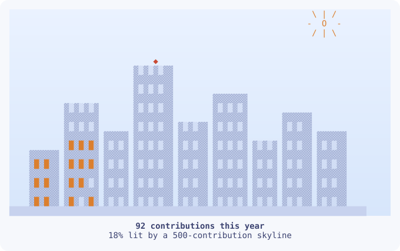

`Hi there, I'm Ioli! 👋`  
`I'm a CS student at the University of Washington.`

   <picture>
     <source media="(prefers-color-scheme: dark)" srcset="skyline-dark.svg">
     <source media="(prefers-color-scheme: light)" srcset="skyline-light.svg">
     
   </picture>

`📫 Email: iolis@cs.washington.edu`  
`🤝 LinkedIn: www.linkedin.com/in/ioli-shrivastava`  

`Languages: Java, Python, C, TypeScript, JavaScript, SQL (PL/SQL)`   
`Technologies & Frameworks: React, Node.js, NestJS, OCI, Terraform, Kubernetes, Ollama, Git, Linux`
